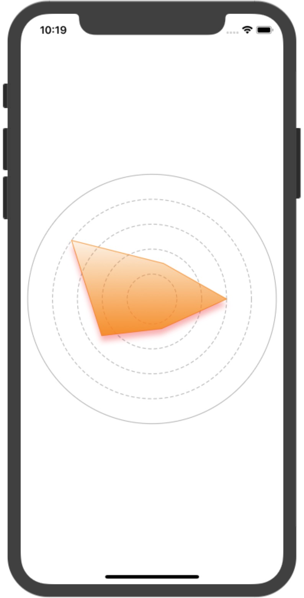

# RadarView
> 雷达图（Radar Chart）

使用Core Graphics绘制的的雷达图

##### 使用方法

```objc
RadarView *radarView = [RadarView new];;
radarView.backgroundColor = [UIColor whiteColor];

[radarView setOutLineColor:[[UIColor orangeColor] colorWithAlphaComponent:0.8]
                    shadowColor:[[UIColor redColor] colorWithAlphaComponent:0.3]
                beginInnerColor:[[UIColor orangeColor] colorWithAlphaComponent:0.1]
                  endInnerColor:[[UIColor orangeColor] colorWithAlphaComponent:0.9]];
    
radarView.regionCount = 5;
radarView.values = @[@(0.6), @(0.25), @(0.5), @(0.8), @(0.3)];
```


